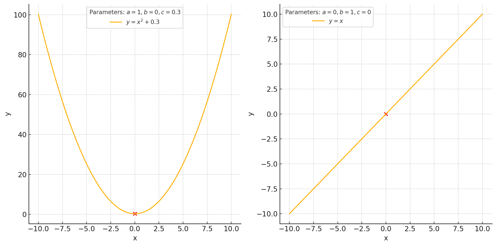

# What is ML?
- setting:
    - quantities $Y$ (response): we would like to know, but cannot (easily) measure
    - quantities $X$ (features): we can measure and are related to $Y$
- idea: learn function $\hat{Y}=f(x)$ such that $\hat{Y}_i\approx Y^*_i$
- traditional science: ask expert to design $f(x)$
- machine learning:
    - choose an "universal function family" $\mathcal{F}$
    - $\mathcal{F}$ has paramaters $\theta$ that fit data $\implies$ $\hat{Y}=f_{\hat{\theta}}(X)$, s.t $\hat{Y}_i\approx Y^*_i$
- example: $\mathcal{F}={ax^2+bx+c},\hat{\theta}=[a,b,c]$

